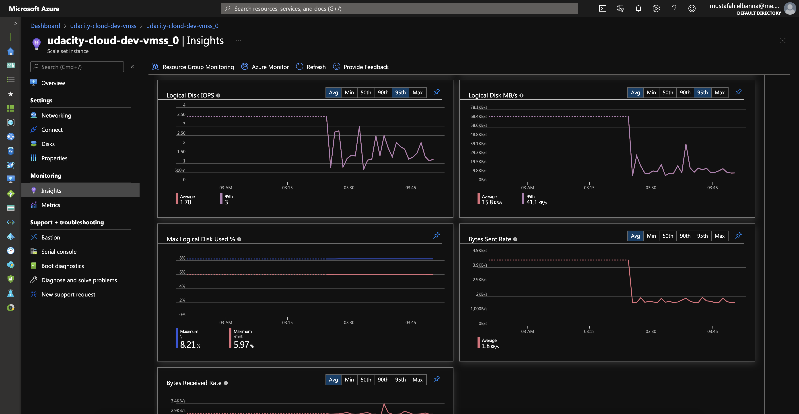
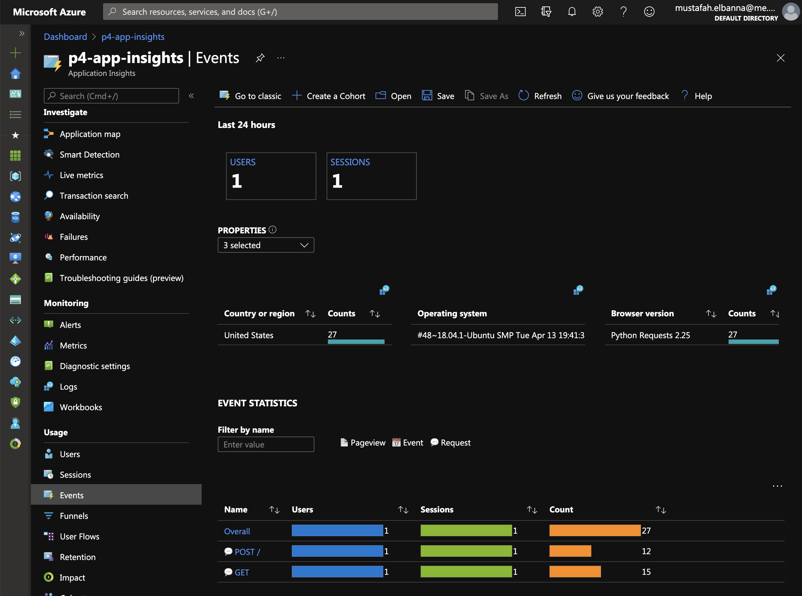
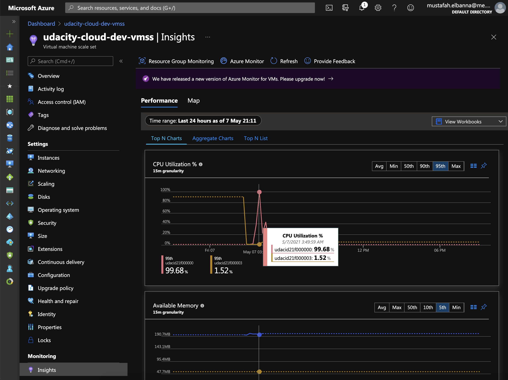
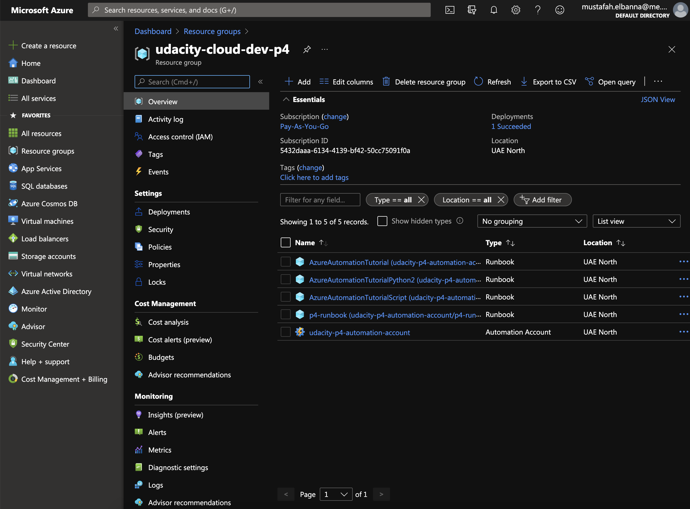

1. Create appropriate Azure resources to utilize Application Insights and Azure Log Analytics. As evidence, provide a screenshot of the resource group containing your running resources. 

## **VMMS screenshots:**

1. Enable **Application Insights** for a **VM Scale Set**. As evidence, provide a screenshot of the metrics from the VM Scale Set instance. This should show the following information:

   ​	• CPU %

   ​	• Available Memory %

   ​	• Information about the Disk

   ​	• Information about the bytes sent and received

2. Import and reference the correct libraries to enable the collection of Application Insights telemetry data.
   * Application Insight Events that show the results of clicking vote for each Dogs & Cats

3.  Create an auto scaling rule for a VM Scale Set.

• The Activity log of the VM scale set that shows it scaled up, including a timestamp.

• The new instances being created.

• The metrics showing the load increasing, then decreasing once scaled up, including a timestamp.

chart-cpu-utilization-1

## Kubernetes cluster:

## Runbooks:

